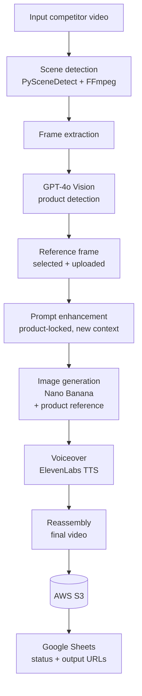

# AI Competitor Video Remaker

> Recreate a competitor's winning marketing video for a new article, language, or market — while keeping the advertised product **pixel-perfect identical**.

## Overview

A marketing team finds a competitor video that converts well. They want the same proven structure and pacing, but adapted to their own offer, a different language, or a new regional market. Rebuilding that by hand — re-shooting, re-editing, re-recording voiceover — is slow and expensive.

This project automates that adaptation. I built a Python pipeline that ingests a source video, breaks it into scenes, and regenerates each scene with fresh visuals and a new voiceover tailored to the target content. The one thing it deliberately does **not** change is the advertised product: GPT-4o Vision detects the product in the original frames, captures a reference image of it, and locks that reference into every generated scene so the product stays visually consistent across the whole remake.

The workflow is driven from a Google Sheet (one row per video job) and all final and intermediate assets are stored in AWS S3, so the system runs as a repeatable batch pipeline rather than a one-off script.

This repository is part of my portfolio as an Automation + Gen AI engineer. It reflects production work, so credentials, sheet IDs, and bucket names have been replaced with placeholders.

## Key Features

- **Product-locked regeneration** — GPT-4o Vision identifies the product (type, brand, colors, materials, packaging), scores each frame for visibility, and selects the best reference frame. That reference is passed into image generation to keep the product identical while everything around it changes.
- **Automatic scene detection** — PySceneDetect (`AdaptiveDetector`) plus OpenCV/FFmpeg split the source video into scenes and extract frames for analysis.
- **Context-aware prompt enhancement** — scene prompts are rewritten to drop the product into a new setting, audience, and mood drawn from the target article, while keeping the product description exact.
- **New image generation** — fresh scene images are generated via Nano Banana, conditioned on the product reference image and description.
- **Regenerated voiceover** — ElevenLabs produces a new voiceover from the adapted script, with selectable voice IDs.
- **Reassembly + delivery** — scenes are recombined into a final video and uploaded to AWS S3, with the resulting URLs written back to the tracking sheet.
- **Sheet-driven batch workflow** — each Google Sheets row is a job; the pipeline reads its configuration, processes it, and writes back status and output URLs.
- **Graceful degradation** — if product detection or a reference upload fails, the pipeline logs it and continues without blocking the rest of the run.

## Architecture



For the full multi-stage flow, fallback strategies, and per-service breakdown, see **[ARCHITECTURE.md](ARCHITECTURE.md)**. For concrete API request/response shapes (Vision detection, prompt enhancement, image generation with a reference), see **[API_EXAMPLES.md](API_EXAMPLES.md)**.

## Tech Stack

| Area | Technology |
|------|-----------|
| Language | Python 3 |
| Product detection / vision | OpenAI GPT-4o Vision |
| Scene detection | PySceneDetect, OpenCV |
| Video / frame processing | FFmpeg |
| Image generation | Nano Banana |
| Voiceover (TTS) | ElevenLabs |
| Object storage | AWS S3 (boto3) |
| Workflow / tracking | Google Sheets (gspread) |
| Config & secrets | python-dotenv |

## Getting Started

### Prerequisites

- Python 3.8+
- FFmpeg installed and on your `PATH`
  - Windows: `choco install ffmpeg` (or download from [ffmpeg.org](https://ffmpeg.org/download.html))
  - macOS: `brew install ffmpeg`
  - Linux: `sudo apt install ffmpeg`
- Accounts / API keys for OpenAI, the image-generation provider, ElevenLabs, and AWS
- A Google Cloud service account with access to your tracking spreadsheet

### Installation

```bash
# 1. Clone and enter the project
git clone <your-fork-url>
cd competitor-video-remaker

# 2. Create and activate a virtual environment
python -m venv .venv
# Windows
.venv\Scripts\activate
# macOS / Linux
source .venv/bin/activate

# 3. Install Python dependencies
pip install -r requirements.txt

# 4. Confirm FFmpeg is available
ffmpeg -version
```

### Configuration

```bash
# Copy the example environment file and fill in your own values
cp .env.example .env
```

Then edit `.env` with your real keys. The expected variables are:

| Variable | Purpose |
|----------|---------|
| `OPENAI_API_KEY` | GPT-4o Vision product detection + prompt enhancement |
| `KIE_API` | Image generation (Nano Banana) |
| `ELEVEN_LABS_API_KEY` | Voiceover generation |
| `AWS_ACCESS_KEY_ID` / `AWS_SECRET_ACCESS_KEY` | S3 access |
| `AWS_BUCKET_NAME` / `AWS_REGION` | S3 destination |
| `SERVICE_ACCOUNT_FILE` | Path to your Google service account JSON |

Provide a Google service account key as `service_account.json` in the project root. This file is **gitignored** and must never be committed — keep your real credentials out of version control.

### Run

```bash
python video_scene_processor.py
```

The processor reads job rows from the configured Google Sheet, runs each one through the pipeline, and writes the output video URLs back to the sheet.

## How It Preserves the Product

Keeping the product identical is the core constraint of this project. It is enforced in three steps:

1. **Detect** — GPT-4o Vision analyzes the extracted frames and returns a precise product description (type, brand, exact colors, materials, packaging, distinctive features) plus a per-frame visibility score and the index of the best frame.
2. **Reference** — the highest-scoring frame is uploaded to cloud storage and used as a visual reference image for generation.
3. **Lock** — every scene's generation prompt is enhanced to restate the exact product description and is conditioned on that reference image, so the surrounding scene (background, people, language, mood) is free to change while the product itself stays consistent.

The result: the same product shown across a fully re-contextualized video.

## Project Structure

```
competitor-video-remaker/
├── video_scene_processor.py   # Main pipeline: config + service classes + orchestrator
├── test_final_stages.py       # Test harness for the final assembly stages
├── requirements.txt           # Python dependencies
├── .env.example               # Environment variable template (placeholders only)
├── .gitignore                 # Excludes secrets, service account JSON, artifacts
├── README.md                  # This file
├── ARCHITECTURE.md            # Full pipeline architecture and data flow
├── API_EXAMPLES.md            # Example API requests and responses
├── SKILL.md                   # Guide to the product-detection module
└── LICENSE
```

`video_scene_processor.py` is organized around a `Config` dataclass and a set of focused service classes (Google Sheets I/O, FFmpeg processing, OpenAI vision/prompts, image generation, ElevenLabs, S3 upload) coordinated by a `VideoSceneProcessor` orchestrator.

   

---

*Built as a portfolio project. All secrets, IDs, and bucket names in this repository are placeholders.*
